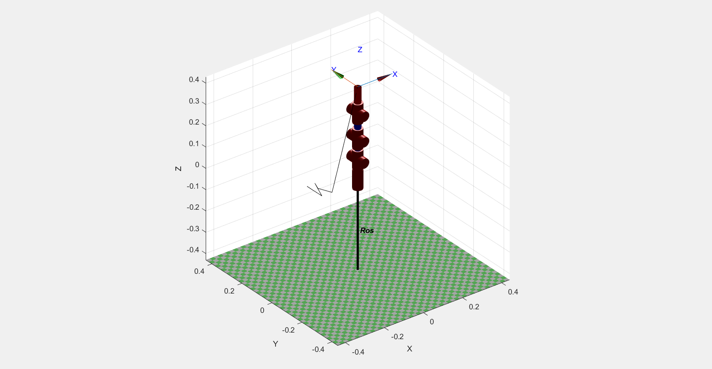

# Robotics Project — 7-DOF Arm Resolved-Rate Control

This project contains the code developed for "Introduction to Robotics" (ECE_ΔΚ703) course: a resolved-rate motion control (Jacobian-based inverse kinematics with quaternion orientation error) for a 7-DOF serial-link arm, driven on real hardware through Arduino-controlled servos to draw on paper with a marker held in the gripper.

  
  

## My code

| File | Description |
|---|---|
| [`fullcode.m`](fullcode.m) | Full pipeline: defines the robot model (D-H parameters, joint limits), runs the resolved-rate IK control loop, then drives the physical arm via an Arduino (`arduino`, `servo`, `writePosition`). |
| [`simulation.m`](simulation.m) | Simulation-only version of the same control loop — computes and animates the joint trajectory in MATLAB without touching hardware. |
| [`qconv.m`](qconv.m) | Helper: returns the Jacobian, end-effector position, and orientation quaternion for a given joint configuration. |

## Third-party dependency

This project is built on Peter Corke's **[Robotics, Vision and Control (RVC) Toolbox for MATLAB](https://petercorke.com/toolboxes/)**,
included here so the code runs out of the box:

- [`robot/`](robot/) — Robotics Toolbox (`SerialLink`, `Link`, kinematics, `.plot`, ...)
- [`spatial-math/`](spatial-math/) — Spatial Math Toolbox (`Quaternion`, `skew`, transforms, ...)
- [`common/`](common/) — shared utility functions used by the above
- `startup_rvc.m` — adds the toolboxes to the MATLAB path (run this first)

These folders are **not my work**: see their own license files
(`robot/LGPL-LICENCE.txt`, `spatial-math/LICENSE`) for terms.

## Running it

1. Open MATLAB in this folder and run `startup_rvc` to add the toolboxes to the path.
2. Run `simulation.m` to simulate the control loop and see the arm animate.
3. `fullcode.m` additionally drives real servos over a serial connection (`COM3`) — only run this with the hardware connected.
